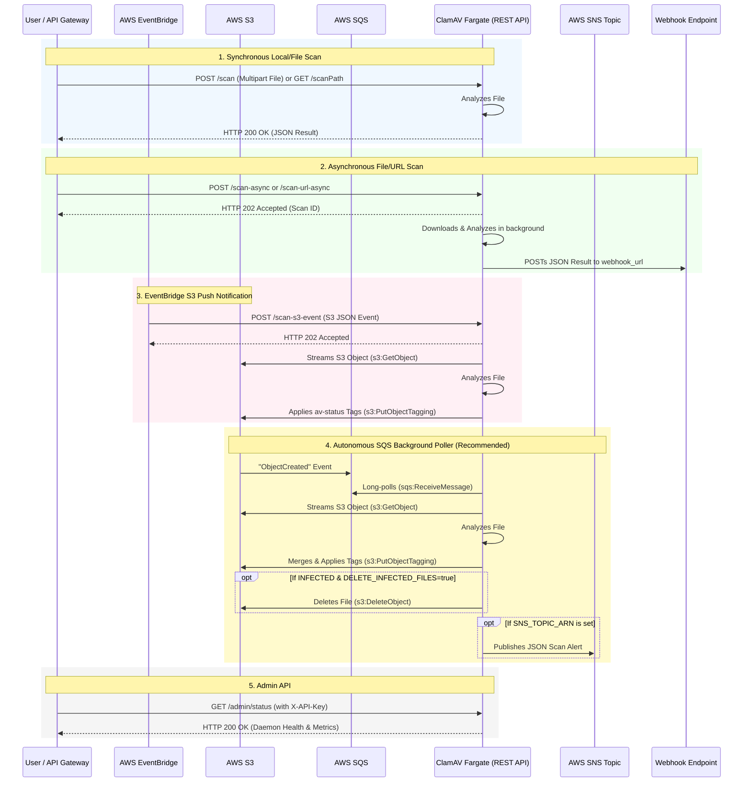
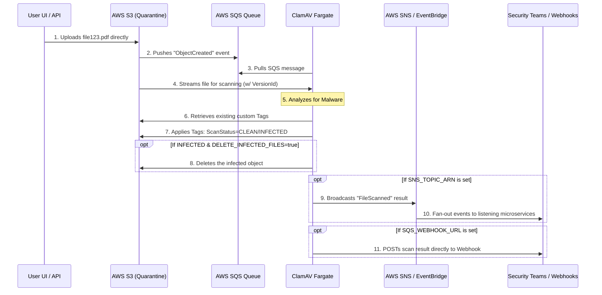

# ClamAV REST API

This project provides a two-in-one Docker image that runs the open-source virus scanner [ClamAV](https://www.clamav.net/), automatically updates virus definitions in the background, and provides a REST API interface to interact with the ClamAV process.

It is designed to be highly scalable, container-friendly (e.g., ECS Fargate), and strictly backward compatible with standard ClamAV REST endpoints.

## Table of Contents

- [Features](#features)
- [Installation](#installation)
- [Quick Start](#quick-start)
    - [Synchronous File Scan](#synchronous-file-scan)
    - [Synchronous URL Scan](#synchronous-url-scan)
    - [Asynchronous Scanning (Webhooks)](#asynchronous-scanning-webhooks)
- [Admin API](#admin-api)
- [Status Codes](#status-codes)
- [Authentication](#authentication)
- [Configuration](#configuration)
- [Maintenance & Monitoring](#maintenance--monitoring)
- [Developing](#developing)

## Features

- **Event-Driven AWS Architecture**: Natively integrates with AWS S3, SQS, and EventBridge to perform Zero-HTTP polling, native S3 streaming, and S3 Object Auto-Tagging (`av-status`, `av-signature`).
- **Advanced S3 Security**: Automatically streams files from S3 without saving to disk, non-destructively merges existing tags with virus results (`av-status`, `av-signature`), actively deletes infected files, and alerts security teams via AWS SNS.
- **Synchronous & Asynchronous Scanning**: Support for standard multipart file uploads as well as stateless async scanning via webhooks.
- **Cloud URL Scanning**: Stream files directly from remote URLs to ClamAV without buffering in memory.
- **API Key Authentication**: Optional security layer to restrict access.
- **Prometheus Metrics**: Built-in `/metrics` endpoint.
- **Admin API**: Secured endpoints to check daemon health, Go runtime metrics, and manually reload the virus database.

## Comprehensive System Architecture

This flowchart maps out every single API endpoint, background worker, and AWS integration that the container supports:



## Installation

You can pull the pre-built, automatically updated Docker image directly from Docker Hub:

```bash
docker pull amithalder/clamav-restapi:alpine-latest
```

*(Alternatively, to use the Rocky Linux variant, pull `amithalder/clamav-restapi:rocky-latest`)*

## Quick Start

Run the `clamav-restapi` docker image locally:
```bash
docker run -d -p 9000:9000 -p 9443:9443 --name clamav-restapi amithalder/clamav-restapi:alpine-latest
```

If you are deploying this on **AWS ECS Fargate** or want to configure it locally with custom limits and API keys, you can pass environment variables using `-e`:

**Using the default Alpine image (`latest`):**
```bash
docker run -d \
  -p 9000:9000 \
  -e API_KEY="my-secret-key" \
  -e ADMIN_API_KEY="my-admin-key" \
  -e CLAMD_PORT="tcp://localhost:3310" \
  -e MAX_FILE_SIZE="25M" \
  -e MAX_SCAN_SIZE="100M" \
  -e MAX_RECURSION="16" \
  -e MAX_FILES="10000" \
  -e MAX_EMBEDDEDPE="10M" \
  -e MAX_HTMLNORMALIZE="10M" \
  -e MAX_HTMLNOTAGS="2M" \
  -e MAX_SCRIPTNORMALIZE="5M" \
  -e MAX_ZIPTYPERCG="1M" \
  -e MAX_PARTITIONS="50" \
  -e MAX_ICONSPE="100" \
  -e PCRE_MATCHLIMIT="100000" \
  -e PCRE_RECMATCHLIMIT="2000" \
  -e SIGNATURE_CHECKS="24" \
  --name clamav-restapi \
  amithalder/clamav-restapi:alpine-latest
```

**Using the Rocky Linux (CentOS) image (`rocky-latest`):**
```bash
docker run -d \
  -p 9000:9000 \
  -e API_KEY="my-secret-key" \
  -e ADMIN_API_KEY="my-admin-key" \
  -e CLAMD_PORT="tcp://localhost:3310" \
  -e MAX_FILE_SIZE="25M" \
  -e MAX_SCAN_SIZE="100M" \
  -e MAX_RECURSION="16" \
  -e MAX_FILES="10000" \
  -e MAX_EMBEDDEDPE="10M" \
  -e MAX_HTMLNORMALIZE="10M" \
  -e MAX_HTMLNOTAGS="2M" \
  -e MAX_SCRIPTNORMALIZE="5M" \
  -e MAX_ZIPTYPERCG="1M" \
  -e MAX_PARTITIONS="50" \
  -e MAX_ICONSPE="100" \
  -e PCRE_MATCHLIMIT="100000" \
  -e PCRE_RECMATCHLIMIT="2000" \
  -e SIGNATURE_CHECKS="24" \
  --name clamav-restapi \
  amithalder/clamav-restapi:rocky-latest
```

### Synchronous File Scan

Test that the service detects a common test virus signature.

**HTTP:**
```bash
$ curl -i -F "file=@eicar.com.txt" http://localhost:9000/scan

HTTP/1.1 100 Continue
HTTP/1.1 406 Not Acceptable
Content-Type: application/json; charset=utf-8
Content-Length: 56

{ "status": "FOUND", "description": "Eicar-Test-Signature" }
```

Test that the service returns 200 for a clean file.

**HTTP:**
```bash
$ curl -i -F "file=@clean_file.txt" http://localhost:9000/scan

HTTP/1.1 100 Continue
HTTP/1.1 200 OK
Content-Type: application/json; charset=utf-8
Content-Length: 33

{ "status": "OK", "description": "" }
```

### Synchronous URL Scan

You can pass a URL (e.g., an S3 pre-signed URL). The API will stream the file directly to ClamAV without buffering it in memory.

```bash
$ curl -i -X POST -H "Content-Type: application/json" -d '{"url":"https://secure.eicar.org/eicar.com.txt"}' http://localhost:9000/scan-url

HTTP/1.1 406 Not Acceptable
Content-Type: application/json; charset=utf-8
Content-Length: 56

{ "status": "FOUND", "description": "Eicar-Test-Signature" }
```

### Asynchronous Scanning (Webhooks)

For very large files, or deployments on stateless infrastructure like AWS ECS Fargate, you can use the asynchronous endpoints. These endpoints return a `202 Accepted` status immediately and process the file in the background.

Once the scan finishes, the container will send an HTTP POST request to your specified `webhook_url` containing the final scan result JSON.

**Async File Upload:**
```bash
curl -i -F "file=@eicar.com.txt" -F "webhook_url=https://your-webhook-endpoint.com/callback" http://localhost:9000/scan-async

HTTP/1.1 202 Accepted
Content-Type: application/json; charset=utf-8

{"scan_id":"uuid-string","message":"Scan started asynchronously"}
```

**Async URL Scan:**
```bash
curl -i -X POST -H "Content-Type: application/json" \
  -d '{"url":"https://secure.eicar.org/eicar.com.txt", "webhook_url":"https://your-webhook-endpoint.com/callback"}' \
  http://localhost:9000/scan-url-async
```

### Event-Driven AWS Integrations (S3 / SQS / EventBridge)

This project natively integrates with AWS to provide seamless event-driven file scanning, which removes the need to stream bytes through your backend API. There are two ways to use this feature:

**1. Autonomous SQS Background Poller (Recommended)**
If you pass the `SQS_QUEUE_URL` environment variable to the container, it launches a background goroutine that constantly long-polls the SQS queue for S3 `ObjectCreated` events. 
When a file is uploaded to your bucket, S3 sends an event to SQS. The container intercepts it, streams the file directly from S3 to the ClamAV daemon (bypassing disk and memory storage), and applies an S3 Object Tag with the result.

**2. HTTP API Push (EventBridge / API Gateway)**
If you prefer to have EventBridge or another service explicitly "push" the S3 Event JSON payload to the scanner, you can `POST` the standard AWS S3 Event Notification JSON directly to the `/scan-s3-event` endpoint:
```bash
curl -i -X POST -H "Content-Type: application/json" -d @s3-event.json http://localhost:9000/scan-s3-event
```

**Advanced S3 Integrations**
- **Non-Destructive S3 Auto-Tagging**: After ClamAV finishes its scan, the API calls `s3.GetObjectTagging` to retrieve your existing tags, safely appends `av-status=CLEAN` (or `INFECTED`), `av-signature`, and `av-timestamp`, and then updates the file. Your custom tags are perfectly preserved!
- **SNS Security Alerts**: If you provide the `SNS_TOPIC_ARN` variable, the container will instantly push a JSON event containing the scan results directly to an AWS SNS Topic. By turning on `SNS_PUBLISH_INFECTED_ONLY=true`, your team will *only* be alerted when actual malware is found!
- **Auto-Deletion**: For the ultimate security posture, if you set `DELETE_INFECTED_FILES=true`, the container will automatically call `s3.DeleteObject` the very millisecond a virus is detected. It eliminates the threat immediately before anyone can download it.
- **Webhook Routing**: To dynamically route a webhook when an S3 file is scanned, set the `x-amz-meta-webhook-url` object metadata when you upload the file to S3, or set the global `SQS_WEBHOOK_URL` environment variable.

### Architecture Diagram



#### AWS IAM & Security Setup

To securely connect S3, SQS, and your ClamAV Fargate containers, you must configure the following AWS Permissions:

**1. S3 to SQS (Resource Policy)**
Attach this Access Policy directly to your SQS Queue to allow S3 to drop events into it:
```json
{
  "Version": "2012-10-17",
  "Statement": [{
    "Effect": "Allow",
    "Principal": { "Service": "s3.amazonaws.com" },
    "Action": "sqs:SendMessage",
    "Resource": "arn:aws:sqs:REGION:ACCOUNT_ID:YOUR_QUEUE_NAME",
    "Condition": {
      "StringEquals": { "aws:SourceAccount": "YOUR_ACCOUNT_ID" },
      "ArnLike": { "aws:SourceArn": "arn:aws:s3:::YOUR_BUCKET_NAME" }
    }
  }]
}
```

**2. Fargate Task Role (IAM Role)**
Your ClamAV container running in ECS Fargate needs this **IAM Task Role** to read from the queue, stream the file, and tag the result.
```json
{
  "Version": "2012-10-17",
  "Statement": [
    {
      "Effect": "Allow",
      "Action": ["sqs:ReceiveMessage", "sqs:DeleteMessage", "sqs:GetQueueAttributes"],
      "Resource": "arn:aws:sqs:REGION:ACCOUNT_ID:YOUR_QUEUE_NAME"
    },
    {
      "Effect": "Allow",
      "Action": [
        "s3:GetObject", 
        "s3:GetObjectVersion", 
        "s3:GetObjectTagging", 
        "s3:PutObjectTagging", 
        "s3:PutObjectVersionTagging", 
        "s3:DeleteObject"
      ],
      "Resource": "arn:aws:s3:::YOUR_BUCKET_NAME/*"
    },
    {
      "Effect": "Allow",
      "Action": ["kms:Decrypt"],
      "Resource": "arn:aws:kms:REGION:ACCOUNT_ID:key/YOUR_KMS_KEY_ID"
    },
    {
      "Effect": "Allow",
      "Action": ["sns:Publish"],
      "Resource": "arn:aws:sns:REGION:ACCOUNT_ID:YOUR_TOPIC_NAME"
    }
  ]
}
```

**3. Restricting Infected File Downloads (S3 Bucket Policy)**
To completely prevent internal users or APIs from downloading infected files, attach this Bucket Policy to your S3 bucket. It tells AWS to block downloads if the scanner tagged the file as infected:
```json
{
  "Version": "2012-10-17",
  "Statement": [{
    "Effect": "Deny",
    "Principal": "*",
    "Action": "s3:GetObject",
    "Resource": "arn:aws:s3:::YOUR_BUCKET_NAME/*",
    "Condition": {
      "StringEquals": { "s3:ExistingObjectTag/av-status": "INFECTED" }
    }
  }]
}
```

### Scan a Local File (Container Disk)

If you have mounted a volume into the container, you can instruct ClamAV to scan a file already residing locally on the container's disk.

```bash
curl -i "http://localhost:9000/scanPath?path=/tmp/suspicious_file.txt"
```

## Admin API

To allow cluster administrators to manage the running ClamAV daemon, we provide a set of administrative endpoints. 

> **Important Security Note:** The Admin API is **disabled by default**. To enable it, you must start the container with the `ADMIN_API_KEY` environment variable. This key must then be provided via the `X-API-Key` or `Authorization` header for all `/admin/*` endpoints.

### 1. Get Daemon Status
Returns comprehensive health data including the ClamAV engine version, signature database info, Go runtime metrics, and the active configuration limits.
```bash
$ curl -H "X-API-Key: your-admin-key" http://localhost:9000/admin/status

{
  "clamav": {
    "engine_version": "ClamAV 1.4.6",
    "signature_version": "28102",
    "signature_date": "Mon Aug 24 08:23:58 2026",
    "threads_live": "1",
    "pools_used": "967.598M"
  },
  "go_metrics": {
    "uptime_seconds": 1284,
    "uptime_human": "21m24s",
    "goroutines": 14,
    "memory_alloc_bytes": 4829104
  },
  "config": {
    "MAX_FILE_SIZE": "25M",
    "MAX_SCAN_SIZE": "100M"
  }
}
```

### 2. Reload Virus Database
Forces the ClamAV daemon to reload its virus database from disk into memory without restarting the container.
```bash
curl -X POST -H "X-API-Key: your-admin-key" http://localhost:9000/admin/reload
```

### 3. Update Signatures
Forces `freshclam` to execute immediately in the background, downloading the absolute latest virus definitions from the internet.
```bash
curl -X POST -H "X-API-Key: your-admin-key" http://localhost:9000/admin/update-signatures
```

## API Routes Reference

Below is a complete reference of all available HTTP endpoints exposed by the service.

| Method | Endpoint | Description | Auth Required |
|--------|----------|-------------|---------------|
| `POST` | `/scan` | Scans a file uploaded via `multipart/form-data` (`file` field). | `API_KEY` (if set) |
| `GET`  | `/scanPath` | Scans a local file already residing on the container's disk (`?path=/tmp/file`). | `API_KEY` (if set) |
| `POST` | `/scan-url` | Scans a file by streaming it from a remote URL. Payload: `{"url":"..."}`. | `API_KEY` (if set) |
| `POST` | `/scan-async` | Asynchronously scans an uploaded file. Requires `file` and `webhook_url` form fields. | `API_KEY` (if set) |
| `POST` | `/scan-url-async` | Asynchronously scans a URL. Payload: `{"url":"...", "webhook_url":"..."}`. | `API_KEY` (if set) |
| `POST` | `/scan-s3-event` | Takes an AWS S3 `ObjectCreated` JSON payload, streams file from S3, and tags it. | `API_KEY` (if set) |
| `GET`  | `/admin/status` | Returns ClamAV engine version and internal memory stats. | `ADMIN_API_KEY` |
| `POST` | `/admin/reload` | Forces ClamAV to hot-reload virus databases from disk to memory. | `ADMIN_API_KEY` |
| `POST` | `/admin/update-signatures` | Forces `freshclam` to update virus signatures immediately in the background. | `ADMIN_API_KEY` |

## Status Codes

The API strictly adheres to the following status codes for all scan endpoints and webhook payloads:
- `200` - Clean file (no known infections)
- `400` - ClamAV returned a general error for the file
- `406` - INFECTED
- `412` - Unable to parse the file
- `501` - Unknown request

## Authentication

By default, the API is completely open. If you wish to secure your endpoints, start the container with the `API_KEY` environment variable.

```bash
docker run -d -p 9000:9000 -e API_KEY=your-secret-key --name clamav-restapi amithalder/clamav-restapi:latest
```

Clients must then provide the key via the `X-API-Key` or `Authorization` header:
```bash
curl -H "X-API-Key: your-secret-key" -F "file=@eicar.com.txt" http://localhost:9000/scan
```

## Configuration

### Environment Variables

Below is the complete list of available options that can be used to customize your installation.

| Parameter | Description |
|-----------|-------------|
| `API_KEY` | Secures the REST API with a required API key. |
| `ADMIN_API_KEY` | Enables and secures the `/admin/*` REST endpoints. |
| `SQS_QUEUE_URL` | Activates the autonomous background SQS consumer for S3 events. |
| `SQS_WEBHOOK_URL` | Fallback webhook URL to hit after an S3 object is scanned and tagged. |
| `DELETE_INFECTED_FILES` | If `true`, the scanner will actively delete infected files from S3 rather than just tagging them. |
| `SNS_TOPIC_ARN` | If set, the scanner will publish a JSON result payload directly to this SNS Topic. |
| `SNS_PUBLISH_INFECTED_ONLY` | If `true`, the scanner will only publish to SNS if a file is infected. |
| `AWS_REGION` | The AWS Region your queue and bucket reside in (e.g. `us-east-1`). Required if using AWS features outside of Fargate. |
| `AWS_ACCESS_KEY_ID` | Your AWS Access Key. Not required if running inside ECS Fargate with a Task Role attached. |
| `AWS_SECRET_ACCESS_KEY` | Your AWS Secret Key. Not required if running inside ECS Fargate with a Task Role attached. |
| `AWS_SESSION_TOKEN` | Your AWS Session Token (for temporary creds). Not required if using standard IAM User or Task Role. |
| `CLAMD_PORT` | The internal connection string used to talk to the ClamAV daemon - Default `tcp://localhost:3310` |
| `MAX_SCAN_SIZE` | Amount of data scanned for each file - Default `100M` |
| `MAX_FILE_SIZE` | Don't scan files larger than this size - Default `25M` |
| `MAX_RECURSION` | How many nested archives to scan - Default `16` |
| `MAX_FILES` | Number of files to scan within an archive - Default `10000` |
| `MAX_EMBEDDEDPE` | Maximum file size for embedded PE - Default `10M` |
| `MAX_HTMLNORMALIZE` | Maximum size of HTML to normalize - Default `10M` |
| `MAX_HTMLNOTAGS` | Maximum size of Normalized HTML File to scan - Default `2M` |
| `MAX_SCRIPTNORMALIZE` | Maximum size of a Script to normalize - Default `5M` |
| `MAX_ZIPTYPERCG` | Maximum size of ZIP to reanalyze type recognition - Default `1M` |
| `MAX_PARTITIONS` | How many partitions per Raw disk to scan - Default `50` |
| `MAX_ICONSPE` | How many Icons in PE to scan - Default `100` |
| `PCRE_MATCHLIMIT` | Maximum PCRE Match Calls - Default `100000` |
| `PCRE_RECMATCHLIMIT` | Maximum Recursive Match Calls to PCRE - Default `2000` |
| `SIGNATURE_CHECKS` | Check times per day for a new database signature. Must be between 1 and 50. - Default `24` |

### Networking

| Port | Description |
|-----------|-------------|
| `9000`    | HTTP REST API Port |
| `9443`    | HTTPS REST API Port |
| `3310`    | Internal ClamD Listening Port |

## Maintenance & Monitoring

### Shell Access

For debugging and maintenance purposes, you may access the container shell:
```bash
docker exec -it clamav-restapi /bin/sh
```

### Enabling HTTPS (TLS)

The REST API natively listens for HTTPS traffic on port `9443`. To enable this securely, you must mount your SSL certificate and key directly into the container at runtime:

```bash
docker run -d \
  -p 9443:9443 \
  -v /path/to/your/cert.crt:/etc/ssl/clamav-rest/server.crt \
  -v /path/to/your/cert.key:/etc/ssl/clamav-rest/server.key \
  amithalder/clamav-restapi:alpine-latest
```

## Developing

To build the project locally (requires Go 1.23+):
```bash
go mod tidy
go build -v .
```

To test the locally built Docker image:
```bash
docker build -t amithalder/clamav-restapi:alpine-latest .
docker run -p 9000:9000 -p 9443:9443 -itd --name clamav-restapi amithalder/clamav-restapi:alpine-latest
```

## References
- https://www.clamav.net
