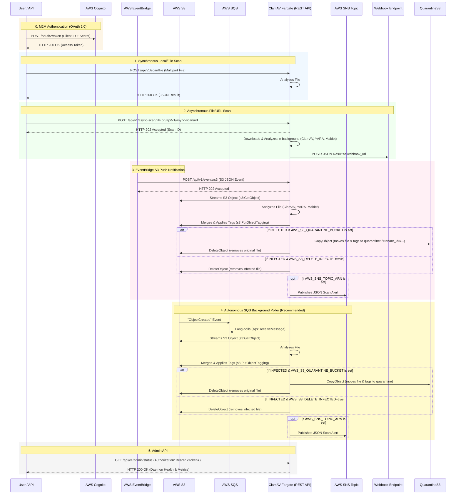

# ClamAV REST API

This project provides a two-in-one Docker image that runs the open-source virus scanner [ClamAV](https://www.clamav.net/), automatically updates virus definitions in the background, and provides a REST API interface to interact with the ClamAV process.

It is designed to be highly scalable, container-friendly (e.g., ECS Fargate), and strictly backward compatible with standard ClamAV REST endpoints.

## Table of Contents
1. [Features](#features)
2. [System Architecture](#system-architecture)
3. [Configuration (Env Vars)](#configuration)
4. [Installation & Deployment](#installation--deployment)
5. [Usage: Core API Endpoints](#usage-core-api-endpoints)
6. [Usage: AWS Event-Driven Scanning](#usage-aws-event-driven-scanning)
7. [Admin API](#admin-api)
8. [API Route Reference & Status Codes](#api-route-reference--status-codes)
9. [Development & Maintenance](#development--maintenance)

---

## Features

- **Event-Driven AWS Architecture**: Natively integrates with AWS S3, SQS, and EventBridge to perform Zero-HTTP polling, native S3 streaming, and S3 Object Auto-Tagging (`av-status`, `av-signature`).
- **Advanced S3 Security**: Automatically streams files from S3 without saving to disk, non-destructively merges existing tags with virus results, actively deletes infected files, and alerts security teams via AWS SNS.
- **Advanced Malware & PDF Detection**: Pre-configured with dynamic YARA heuristics and Linux Malware Detect (Maldet) signatures natively downloaded into the Docker image. Curated to aggressively block malicious macros, phishing payloads, zero-day JavaScript embedded within PDFs, and modern web shells—closing the gaps in standard ClamAV databases without massive memory overhead.
- **Enterprise Audit Logging**: Full support for native structured JSON logs (`log/slog`), directly indexing `scan_id`, `duration_ms`, `result`, and `client_id` instantly into CloudWatch for security dashboards.
- **Security Hardening**: Built-in protection against Server-Side Request Forgery (SSRF) for remote URL scanning, Path Traversal on local files and on tenant-scoped S3 quarantine keys, strict HTTP body size limits (`MaxBytesReader`) plus bounded scan-engine and HTTP request/response timeouts to prevent memory/disk/connection exhaustion Denial of Service (DoS), and JSON-injection safe SNS payloads.
- **SaaS Multi-Tenancy & Data Isolation**: Securely supports multi-tenant operations (e.g., multiple enterprise applications) via Cognito JWT `client_id` extraction, strictly partitioning Redis/Dragonfly caching keys and S3 Quarantine routes per tenant.
- **Concurrent Multi-Engine Scanning**: Analyzes files simultaneously across ClamAV, YARA (Behavioral), and Linux Malware Detect (Maldet) in separate Go routines, vastly improving zero-day and web-shell detection without a 3x time penalty. Applies to every scanning endpoint, including async URL scans. Each engine runs under a bounded timeout (`SCAN_ENGINE_TIMEOUT_SECONDS`); if YARA or Maldet fails to complete (crash, missing binary, or timeout), the result explicitly flags it (`WARNING: ... engine(s) did not complete - scan coverage reduced`) instead of silently reporting a false all-clear.
- **Synchronous & Asynchronous Scanning**: Support for standard multipart file uploads as well as stateless async scanning via webhooks (with dynamic tenant-based webhook routing).
- **Cloud URL Scanning**: Stream files directly from remote URLs to the engines without buffering in memory.
- **JWT Authentication**: Secure the API using AWS Cognito (or any OIDC provider) by validating Bearer tokens against a remote JWKS.
- **Admin API**: Secured endpoints to check daemon health, Go runtime metrics, and manually reload the virus database.

### Dynamic Threat Intel & Memory Optimization

To aggressively close the gap against modern delivery vectors without bloating the container, ClamTrac natively integrates two supplementary scanners:
- **YARA (Behavioral Analysis)**: Driven by the open-source `signature-base` repository. 
- **Linux Malware Detect (Maldet)**: Specialized in Web Shells and Linux rootkits.

The container runs an autonomous background daemon (`update_signatures.sh`) every 12 hours that clones the absolute latest YARA and Maldet heuristics directly from their source repositories and hot-reloads them. 

> **Note on ECS Scaling:** Previous versions downloaded 9 massive Sanesecurity text databases which required 4GB+ of RAM. By removing those in favor of Maldet/YARA, and disabling `ConcurrentDatabaseReload` in `clamd.conf`, **this entire stack can now run comfortably inside a 2GB ECS Task**.

---

## System Architecture

This sequence diagram maps out every single API endpoint, background worker, and AWS integration that the container supports:



---

## Configuration

Below is the complete list of available environment variables that can be used to customize your installation.

| Parameter | Description |
|-----------|-------------|
| `COGNITO_JWKS_URL` | The URL to your Cognito User Pool's JWKS endpoint (e.g. `https://cognito-idp.us-east-1.amazonaws.com/USER_POOL_ID/.well-known/jwks.json`). If not set, authentication is disabled. |
| `COGNITO_ISSUER` | (Optional) The expected `iss` claim to validate in the JWT (e.g. `https://cognito-idp.us-east-1.amazonaws.com/USER_POOL_ID`). |
| `REDIS_URL` | The connection string for Dragonfly/Redis (e.g. `redis://dragonfly:6379`). Used for multi-tenant webhook caching and data isolation. |
| `AWS_SQS_QUEUE_URL` | Activates the autonomous background SQS consumer for S3 events. |
| `APP_WEBHOOK_URL` | Fallback centralized webhook URL to hit after an S3 object is scanned or if an async scan provides no tenant-specific URL. |
| `ASYNC_TEMP_DIR` | The temp directory to use when saving multipart uploads for async scanning (e.g., `/tmp`). |
| `SCAN_ENGINE_TIMEOUT_SECONDS` | Maximum time (in seconds) a single YARA or Maldet invocation may run before being killed and reported as a failed engine - Default `300` (5 minutes). |
| `AWS_S3_DELETE_INFECTED` | If `true`, the scanner will actively delete infected files from S3. |
| `AWS_S3_QUARANTINE_BUCKET`| If set to a bucket name, infected files will be copied here and deleted from the source bucket. |
| `AWS_SNS_TOPIC_ARN` | If set, the scanner will publish a JSON result payload directly to this SNS Topic. |
| `AWS_SNS_ONLY_INFECTED` | If `true`, the scanner will only publish to SNS if a file is infected. |
| `AWS_REGION` | The AWS Region your queue and bucket reside in (e.g. `us-east-1`). |
| `AWS_ENDPOINT_URL` | Optional custom endpoint URL for S3/SQS (useful for LocalStack, MinIO, or Ceph). |
| `AWS_ACCESS_KEY_ID` | Your AWS Access Key. Not required if running inside ECS Fargate with a Task Role. |
| `AWS_SECRET_ACCESS_KEY` | Your AWS Secret Key. Not required if running inside ECS Fargate with a Task Role. |
| `AWS_SESSION_TOKEN` | Your AWS Session Token. Not required if using standard IAM User or Task Role. |
| `APP_ALLOW_PRIVATE_IPS` | If `true`, disables SSRF protection and allows webhooks/URLs to hit private subnets (e.g., `10.x`, `172.x`). Use only for isolated testing! |
| `APP_CLAMD_ENDPOINT` | The internal connection string used to talk to the ClamAV daemon - Default `tcp://localhost:3310` |
| `MAX_SCAN_SIZE` | Amount of data scanned for each file - Default `200M` |
| `MAX_FILE_SIZE` | Don't scan files larger than this size - Default `100M` |
| `MAX_RECURSION` | How many nested archives to scan - Default `32` |
| `MAX_FILES` | Max number of files to extract from archives - Default `50000` |
| `MAX_EMBEDDEDPE` | Maximum file size for embedded PE - Default `10M` |
| `MAX_HTMLNORMALIZE` | Maximum size of HTML to normalize - Default `10M` |
| `MAX_HTMLNOTAGS` | Maximum size of Normalized HTML File to scan - Default `2M` |
| `MAX_SCRIPTNORMALIZE` | Maximum size of a Script to normalize - Default `5M` |
| `MAX_ZIPTYPERCG` | Maximum size of ZIP to reanalyze type recognition - Default `1M` |
| `MAX_PARTITIONS` | How many partitions per Raw disk to scan - Default `50` |
| `MAX_ICONSPE` | How many Icons in PE to scan - Default `100` |
| `PCRE_MATCHLIMIT` | Maximum PCRE Match Calls - Default `100000` |
| `PCRE_RECMATCHLIMIT` | Maximum Recursive Match Calls to PCRE - Default `2000` |
| `SIGNATURE_CHECKS` | Check times per day for a new database signature. - Default `24` |

---

## Installation & Deployment

You can pull the pre-built, automatically updated Docker image directly from Docker Hub:

```bash
docker pull amithalder/clamav-restapi:latest
```

Run the `clamav-restapi` docker image locally passing any configuration variables using `-e`:

```bash
docker run -d \
  -p 9000:9000 \
  -e COGNITO_JWKS_URL="https://cognito-idp.us-east-1.amazonaws.com/us-east-1_12345/.well-known/jwks.json" \
  -e COGNITO_ISSUER="https://cognito-idp.us-east-1.amazonaws.com/us-east-1_12345" \
  -e REDIS_URL="redis://dragonfly:6379" \
  -e AWS_SQS_QUEUE_URL="https://sqs.us-east-1.amazonaws.com/123/my-queue" \
  -e APP_WEBHOOK_URL="https://webhook.site/your-id" \
  -e ASYNC_TEMP_DIR="/tmp" \
  -e SCAN_ENGINE_TIMEOUT_SECONDS="300" \
  -e AWS_S3_DELETE_INFECTED="false" \
  -e AWS_S3_QUARANTINE_BUCKET="my-quarantine-bucket" \
  -e AWS_SNS_TOPIC_ARN="arn:aws:sns:us-east-1:123:my-topic" \
  -e AWS_SNS_ONLY_INFECTED="true" \
  -e AWS_REGION="us-east-1" \
  -e AWS_ACCESS_KEY_ID="AKIA..." \
  -e AWS_SECRET_ACCESS_KEY="..." \
  -e AWS_SESSION_TOKEN="..." \
  -e APP_CLAMD_ENDPOINT="tcp://localhost:3310" \
  -e MAX_SCAN_SIZE="100M" \
  -e MAX_FILE_SIZE="25M" \
  -e MAX_RECURSION="16" \
  -e MAX_FILES="10000" \
  -e MAX_EMBEDDEDPE="10M" \
  -e MAX_HTMLNORMALIZE="10M" \
  -e MAX_HTMLNOTAGS="2M" \
  -e MAX_SCRIPTNORMALIZE="5M" \
  -e MAX_ZIPTYPERCG="1M" \
  -e MAX_PARTITIONS="50" \
  -e MAX_ICONSPE="100" \
  -e PCRE_MATCHLIMIT="100000" \
  -e PCRE_RECMATCHLIMIT="2000" \
  -e SIGNATURE_CHECKS="24" \
  --name clamav-restapi \
  amithalder/clamav-restapi:latest
```

*(Note: Port 9000 is HTTP, Port 9443 is HTTPS. You can mount your own certs to `/etc/ssl/clamav-rest/` for TLS).*

---


## Service-to-Service Integration Guide (Authentication)

Because this API uses **Machine-to-Machine (M2M)** authentication, there are no users, passwords, or UI login screens. Connecting services (e.g., your backend microservices) must authenticate using the **OAuth 2.0 Client Credentials Grant**.

### 1. Fetching a JWT from AWS Cognito
Your calling service must use its `Client ID` and `Client Secret` to request an Access Token from the Cognito Token Endpoint:

```bash
curl -X POST https://YOUR_COGNITO_DOMAIN.auth.us-east-1.amazoncognito.com/oauth2/token \
  -H "Content-Type: application/x-www-form-urlencoded" \
  -u "YOUR_CLIENT_ID:YOUR_CLIENT_SECRET" \
  -d "grant_type=client_credentials"

# Response:
# {
#   "access_token": "eyJraWQi...",
#   "expires_in": 3600,
#   "token_type": "Bearer"
# }
```

### 2. Calling the ClamAV REST API
Once your service has the `access_token`, inject it into the HTTP headers of all API requests using the standard `Authorization: Bearer <token>` format:

```bash
curl -i -H "Authorization: Bearer eyJraWQi..." http://clamav-restapi:9000/api/v1/scan/url
```

---

## Usage: Core API Endpoints

### 1. Synchronous File Scan
Uploads a file directly to the API, blocks until the scan is complete, and returns the result.

```bash
$ curl -i -F "file=@eicar.com.txt" -H "Authorization: Bearer $JWT_TOKEN" http://localhost:9000/api/v1/scan/file

HTTP/1.1 406 Not Acceptable
{ "filename": "eicar.com.txt", "av-status": "INFECTED", "av-signature": "Eicar-Test-Signature", "av-timestamp": "2026/08/25 02:00:11 UTC" }
```

### 2. Synchronous URL Scan
Passes a URL to the API. The API will stream the file directly to ClamAV without buffering it in memory.

```bash
curl -i -X POST -H "Content-Type: application/json" \
  -d '{"url":"https://secure.eicar.org/eicar.com.txt"}' \
  http://localhost:9000/api/v1/scan/url

HTTP/1.1 406 Not Acceptable
{ "filename": "https://secure.eicar.org/eicar.com.txt", "av-status": "INFECTED", "av-signature": "Eicar-Test-Signature", "av-timestamp": "2026/08/25 02:00:11 UTC" }
```

### 3. Asynchronous Scanning (Webhooks)
For large files, you can upload a file (or pass a URL) and immediately receive a `202 Accepted`. The scanner will process the file in the background and POST the JSON result to your provided `webhook_url`.

```bash
curl -i -F "file=@eicar.com.txt" -F "webhook_url=https://your-domain.com/callback" http://localhost:9000/api/v1/async-scan/file

HTTP/1.1 202 Accepted
{"scan_id":"uuid-string","message":"Scan started asynchronously","filename":"eicar.com.txt"}

**Webhook Callback Payload (Sent later):**
```json
{
  "filename": "eicar.com.txt",
  "scan_id": "uuid-string",
  "av-status": "INFECTED",
  "av-signature": "Eicar-Test-Signature",
  "av-timestamp": "2026/08/25 02:00:11 UTC"
}
```
```


### 4. Asynchronous URL Scanning
Similar to file uploads, you can also pass a JSON payload with a URL to be scanned asynchronously.

```bash
curl -i -X POST -H "Content-Type: application/json" \
  -H "Authorization: Bearer $JWT_TOKEN" \
  -d '{"url":"https://secure.eicar.org/eicar.com.txt", "webhook_url":"https://your-domain.com/callback"}' \
  http://localhost:9000/api/v1/async-scan/url

HTTP/1.1 202 Accepted
{"scan_id":"uuid-string","message":"Scan started asynchronously","filename":"https://secure.eicar.org/eicar.com.txt"}
```


---

## Usage: AWS Event-Driven Scanning

This project natively integrates with AWS to provide seamless event-driven file scanning, which removes the need to stream bytes through your backend API. There are two ways to use this feature:

### 1. Autonomous SQS Background Poller (Recommended)
If you pass the `AWS_SQS_QUEUE_URL` environment variable to the container, it launches a background goroutine that constantly long-polls the SQS queue for S3 `ObjectCreated` events. 
When a file is uploaded to your bucket, S3 sends an event to SQS. The container intercepts it, streams the file directly from S3 to the ClamAV daemon (bypassing disk and memory storage), and applies an S3 Object Tag with the result.

### 2. HTTP API Push (EventBridge / API Gateway)
If you prefer to have EventBridge or another service explicitly "push" the S3 Event JSON payload to the scanner, you can `POST` the standard AWS S3 Event Notification JSON directly to the `/api/v1/events/s3` endpoint:
```bash
curl -i -X POST -H "Content-Type: application/json" -d @s3-event.json http://localhost:9000/api/v1/events/s3

HTTP/1.1 202 Accepted
{"scan_id":"uuid-string","message":"S3 Event processing started asynchronously"}
```

### Advanced S3 Features
Regardless of which method you use, the integration handles the following natively:
- **Non-Destructive S3 Auto-Tagging**: After ClamAV finishes its scan, the API calls `s3.GetObjectTagging` to retrieve your existing tags, safely appends `av-status=CLEAN` (or `INFECTED`), `av-signature`, and `av-timestamp`, and then updates the file. Your custom tags are perfectly preserved!
- **SNS Security Alerts**: If you provide the `AWS_SNS_TOPIC_ARN` variable, the container will instantly push a JSON event containing the scan results directly to an AWS SNS Topic. By turning on `AWS_SNS_ONLY_INFECTED=true`, your team will *only* be alerted when actual malware is found.
- **Malware Quarantine**: If you define `AWS_S3_QUARANTINE_BUCKET`, any discovered malware is immediately copied to a safe, isolated quarantine bucket (preserving the `av-status=INFECTED` tag) and then securely deleted from the source upload bucket. This allows your security team to safely inspect the malware payload without exposing your users.
- **Auto-Deletion**: Alternatively, if you set `AWS_S3_DELETE_INFECTED=true` without a quarantine bucket, the container will simply `s3.DeleteObject` the very millisecond a virus is detected.
- **Webhook Routing**: To dynamically route a webhook when an S3 file is scanned, set the `x-amz-meta-webhook-url` object metadata when you upload the file to S3, or set the global `APP_WEBHOOK_URL` environment variable.

### AWS IAM & Security Setup
To securely connect S3, SQS, and your ClamAV Fargate containers, you must configure the following AWS Permissions:

**1. S3 to SQS (Resource Policy)**
Attach this Access Policy directly to your SQS Queue to allow S3 to drop events into it:
```json
{
  "Version": "2012-10-17",
  "Statement": [{
    "Effect": "Allow",
    "Principal": { "Service": "s3.amazonaws.com" },
    "Action": "sqs:SendMessage",
    "Resource": "arn:aws:sqs:REGION:ACCOUNT_ID:YOUR_QUEUE_NAME",
    "Condition": {
      "StringEquals": { "aws:SourceAccount": "YOUR_ACCOUNT_ID" },
      "ArnLike": { "aws:SourceArn": "arn:aws:s3:::YOUR_BUCKET_NAME" }
    }
  }]
}
```

**2. Fargate Task Role (IAM Role)**
Your ClamAV container running in ECS Fargate needs this **IAM Task Role** to read from the queue, stream the file, and tag the result.
```json
{
  "Version": "2012-10-17",
  "Statement": [
    {
      "Effect": "Allow",
      "Action": ["sqs:ReceiveMessage", "sqs:DeleteMessage", "sqs:GetQueueAttributes"],
      "Resource": "arn:aws:sqs:REGION:ACCOUNT_ID:YOUR_QUEUE_NAME"
    },
    {
      "Effect": "Allow",
      "Action": [
        "s3:GetObject", 
        "s3:GetObjectVersion", 
        "s3:GetObjectTagging", 
        "s3:PutObjectTagging", 
        "s3:PutObjectVersionTagging", 
        "s3:DeleteObject"
      ],
      "Resource": [
        "arn:aws:s3:::YOUR_UPLOAD_BUCKET/*",
        "arn:aws:s3:::YOUR_QUARANTINE_BUCKET/*"
      ]
    },
    {
      "Effect": "Allow",
      "Action": ["kms:Decrypt"],
      "Resource": "arn:aws:kms:REGION:ACCOUNT_ID:key/YOUR_KMS_KEY_ID"
    },
    {
      "Effect": "Allow",
      "Action": ["sns:Publish"],
      "Resource": "arn:aws:sns:REGION:ACCOUNT_ID:YOUR_TOPIC_NAME"
    }
  ]
}
```

**3. Restricting Infected File Downloads (S3 Bucket Policy)**
To completely prevent internal users or APIs from downloading infected files, attach this Bucket Policy to your S3 bucket. It tells AWS to block downloads if the scanner tagged the file as infected:
```json
{
  "Version": "2012-10-17",
  "Statement": [{
    "Effect": "Deny",
    "Principal": "*",
    "Action": "s3:GetObject",
    "Resource": "arn:aws:s3:::YOUR_BUCKET_NAME/*",
    "Condition": {
      "StringEquals": { "s3:ExistingObjectTag/av-status": "INFECTED" }
    }
  }]
}
```

---

## Admin API

To allow cluster administrators to manage the running ClamAV daemon, we provide a set of administrative endpoints. 

> **Important Security Note:** The Admin API is **disabled by default**. To enable it, you must configure `COGNITO_JWKS_URL`. Administrative users must have the `admin` scope or belong to the `admin` Cognito group in their JWT to access the `/admin/*` endpoints.

### 1. Get Daemon Status
Returns comprehensive health data including the ClamAV engine version, signature database info, Go runtime metrics, and the active configuration limits.
```bash
$ curl -H "Authorization: Bearer $JWT_TOKEN" http://localhost:9000/api/v1/admin/status

HTTP/1.1 200 OK
{
  "raw_version": "ClamAV 1.4.6/28102/Mon Aug 24 08:23:58 2026",
  "clamav": { "engine_version": "1.4.6", "signature_version": "28102", "signature_date": "Mon Aug 24 08:23:58 2026" },
  "stats": { "Pools": "1", "State": "VALID PRIMARY", "Threads": "live 1  idle 0 max 10 idle-timeout 30", "Queue": "0 items" },
  "config": { "APP_CLAMD_ENDPOINT": "tcp://localhost:3310", "MAX_FILE_SIZE": "25M" },
  "go_metrics": { "uptime_seconds": 120, "uptime_human": "2m0s", "goroutines": 4, "memory_allocated_mb": 1.5 }
}
```

### 2. Reload Virus Database
Forces the ClamAV daemon to reload its virus database from disk into memory without restarting the container.
```bash
$ curl -X POST -H "Authorization: Bearer $JWT_TOKEN" http://localhost:9000/api/v1/admin/reload

HTTP/1.1 200 OK
{"message": "Reload command sent to ClamAV successfully."}
```

### 3. Update Signatures
Forces `freshclam` to execute immediately in the background, downloading the absolute latest virus definitions from the internet.
```bash
$ curl -X POST -H "Authorization: Bearer $JWT_TOKEN" http://localhost:9000/api/v1/admin/update-signatures

HTTP/1.1 202 Accepted
{"message": "Signature update (freshclam) started in the background."}
```

---

## API Route Reference & Status Codes

| Method | Endpoint | Description | Auth Required |
|--------|----------|-------------|---------------|
| `POST` | `/api/v1/scan/file` | Scans a file uploaded via `multipart/form-data` (`file` field). | `COGNITO_JWKS_URL` |

| `POST` | `/api/v1/scan/url` | Scans a file by streaming it from a remote URL. Payload: `{"url":"..."}`. | `COGNITO_JWKS_URL` |
| `POST` | `/api/v1/async-scan/file` | Asynchronously scans an uploaded file. Requires `file` and `webhook_url` form fields. | `COGNITO_JWKS_URL` |
| `POST` | `/api/v1/async-scan/url` | Asynchronously scans a URL. Payload: `{"url":"...", "webhook_url":"..."}`. | `COGNITO_JWKS_URL` |
| `POST` | `/api/v1/events/s3` | Takes an AWS S3 `ObjectCreated` JSON payload, streams file from S3, and tags it. | `COGNITO_JWKS_URL` |
| `GET`  | `/api/v1/admin/status` | Returns ClamAV engine version and internal memory stats. | `admin` JWT scope |
| `POST` | `/api/v1/admin/reload` | Forces ClamAV to hot-reload virus databases from disk to memory. | `admin` JWT scope |
| `POST` | `/api/v1/admin/update-signatures` | Forces `freshclam` to update virus signatures immediately in the background. | `admin` JWT scope |

The API strictly adheres to the following HTTP status codes for all scan endpoints and webhook payloads:
- `200` - Clean file (no known infections)
- `400` - ClamAV returned a general error for the file
- `406` - INFECTED
- `412` - Unable to parse the file
- `501` - Unknown request

> **Note on degraded scans:** if YARA or Maldet fails to complete for a given scan (crash, missing binary, or exceeding `SCAN_ENGINE_TIMEOUT_SECONDS`), the HTTP status code still reflects the engines that *did* complete, but the `av-signature` field is appended with `WARNING: <Engine> engine(s) did not complete - scan coverage reduced` so callers can detect and act on reduced detection coverage rather than trusting a false all-clear.

---

## Development & Maintenance

To build the project locally (requires Go 1.23+):
```bash
go mod tidy
go build -v .
```

To test the locally built Docker image standalone:
```bash
docker build -t amithalder/clamav-restapi:alpine-latest .
docker run -p 9000:9000 -p 9443:9443 -itd --name clamav-restapi amithalder/clamav-restapi:alpine-latest
```

### Comprehensive Local Test Rig

This project includes a full Docker Compose test rig that spins up the API, a mock webhook receiver, and LocalStack (for S3 and SQS testing). It allows you to run end-to-end regression tests locally, ensuring features like async scanning, SQS event polling, S3 object tagging, and SSRF protections work properly.

#### What it spins up
- **LocalStack** — fake S3 + SQS + SNS on `http://localhost:4566`. The init script auto-creates an S3 bucket (`clamrest-uploads`), an SQS queue (`clamrest-scan-queue`) wired to receive `ObjectCreated` events from that bucket, and an SNS topic (`clamrest-scan-results`).
- **webhook-receiver** — a tiny Python listener on `:8080` that logs every webhook POST the app sends it, so you can verify `/api/v1/async-scan/file`, `/api/v1/async-scan/url`, and S3-triggered scans actually deliver results.
- **clamav-rest** — your app, built from the existing `Dockerfile`, pointed at LocalStack via `AWS_ENDPOINT_URL` and dummy credentials.

#### Running the Test Suite

```bash
# 1. Spin up the local test environment (API, LocalStack, Webhook Receiver, Cognito)
./clamtrac docker restart

# 2. Watch it come healthy
docker compose -f docker-compose.local.yml logs -f clamav-rest

# 3. Run the automated test scripts using the unified CLI
./clamtrac test e2e       # Multi-tenant Auth, Dragonfly isolation, Quarantine
./clamtrac test api       # SSRF, Upload Limits, Basic File Scanning
./clamtrac test sqs       # S3 ObjectCreated background SQS polling

# 4. Tear down the environment when finished
docker compose -f docker-compose.local.yml down -v
```

#### What the test script covers

| # | Endpoint | What it checks |
|---|----------|-----------------|
| 1 | `GET /` | health check |
| 2 | `POST /api/v1/scan/url` | unauthenticated request rejected (401) |
| 3 | `POST /api/v1/scan/file` | clean file → CLEAN |
| 4 | `POST /api/v1/scan/file` | EICAR test string → INFECTED (406) |
| 5 | `POST /api/v1/scan/file` | 101MB upload rejected (413) — the DoS fix |

| 7 | `POST /api/v1/scan/url` | `169.254.169.254` (cloud metadata) blocked (400) — SSRF fix |
| 8 | `POST /api/v1/scan/url` | legitimate external URL scans successfully |
| 9 | `POST /api/v1/async-scan/file` | EICAR upload → 202, webhook receives INFECTED result |
| 10 | `POST /api/v1/async-scan/url` | same, via URL fetch |
| 11 | `GET /api/v1/admin/status` | wrong admin key → 403, correct key → 200 |
| 12 | `POST /api/v1/admin/update-signatures` | freshclam triggered → 202 |
| 13 | `POST /api/v1/admin/reload` | clamd reloaded → 200 |
| 14 | S3 upload → SQS → scan → tag → webhook | full async pipeline |

#### Running the Go unit tests

The repo's own unit tests (covering SSRF + path traversal) can run directly against the Go toolchain without Docker:
```bash
go test ./... -v
```

## References
- https://www.clamav.net
